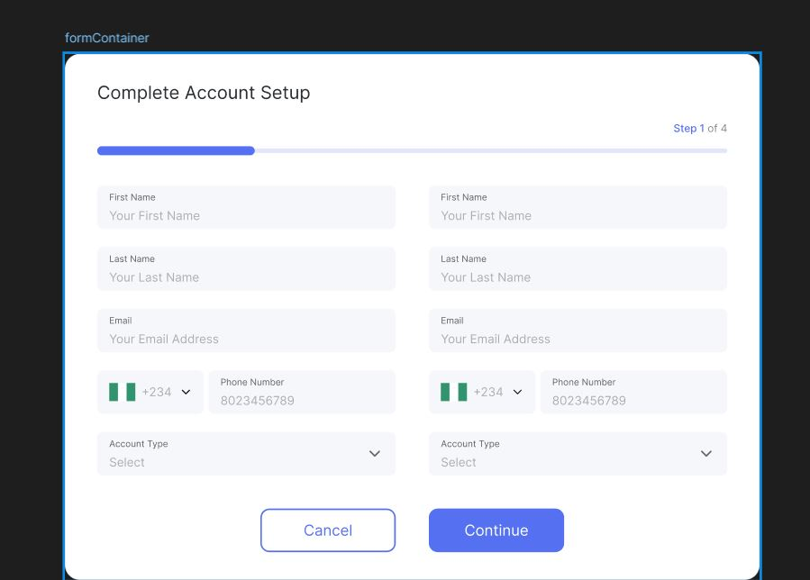
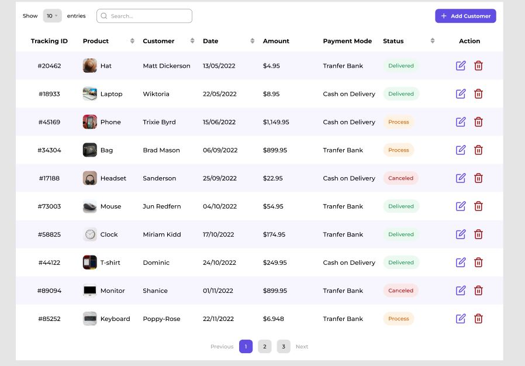

# Order Tracking System

## 📌 Overview

Order Tracking System is a **fully responsive** web form designed to provide a seamless user experience.  
The project ensures a clean and modern UI by utilizing:

- 🎨 **Normalize.css**: For consistent styling across different browsers.
- 🔥 **Font Awesome**: For professional-looking icons.

## 📋 Form Structure

The form includes:

- **First Name & Last Name** input fields.
- **Email Address** input field.
- **Phone Number** field with a country code selector.
- **Account Type** dropdown selection.
- **Progress Bar** to indicate form completion steps.
- **Two Buttons**: `Cancel` and `Continue`.

## 🖥️ Technologies Used

- HTML5
- CSS3
- Normalize.css
- Font Awesome

## 📸 UI Preview

